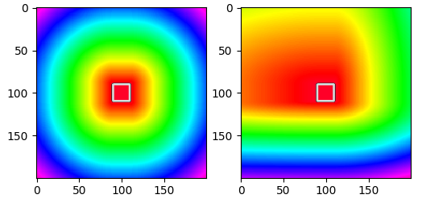

anisotropic-distance-transform
===

This is a C-based numpy plugin implementing the "marching parabolas" algorithm
to compute the 2D Euclidean Distance Transform, as first proposed by
[Felzenszwalb and Huttenlocher](http://cs.brown.edu/people/pfelzens/dt/)
(doi:10.4086/toc.2012.v008a019). It supports `inf` and runs in linear time.

This package is an adaptation of [Jan Hosang's gdt
code](https://github.com/hosang/gdt). It is unique in its support for asymmetric
anisotropy, i.e. it allows you to specify the slope of the distance transform in
all four cardinal directions.

If you are looking for an implementation optimized for higher-dimensional input
data, check out [this
package](https://github.com/seung-lab/euclidean-distance-transform-3d/).

## Usage

The module exports a single function that can be called on a 2D numpy array. The array will be 
modified in place. The following example image is generated by the code below:



```python
import numpy as np
import matplotlib.pyplot as plt

import adt

# Create an image (here, just a square in the middle of zeros)
orig_img = np.zeros((200, 200)).astype(np.float32)
orig_img[90:110, 90:110] = 1.

# Define a maximum value (see the marching parabolas paper)
maxval = (np.sqrt(2)*200) ** 2 * 10 * 2

# Set everything to the maxval, except for the square (which becomes zero) ...
adt_img_1 = maxval - maxval * orig_img
# ... then apply the distance transform in place, like so
adt.adt(adt_img_1, 1, 1, 1, 1)

adt_img_2 = maxval - maxval * orig_img
# ... and, optionally, set factors for values for left, right, top, and bottom
adt.adt(adt_img_2, .5, 2., 1., 4.)

fig, ax = plt.subplots(1, 2)
ax[0].imshow(adt_img_1, cmap='gist_rainbow')
ax[0].contour(orig_img, cmap='gray')
ax[1].imshow(adt_img_2, cmap='gist_rainbow')
ax[1].contour(orig_img, cmap='gray')
plt.show()
```

## Algorithm

Unlike in the isotropic case, the anisotropic case requires us to handle three situations between successive parabolas:

  1. the right arm of a parabola intersects with the right arm of a later parabola;
  3. the left arm of a parabola intersects with the left arm of a later parabola;
  2. the right arm of a parabola intersects with the left arm of a later parabola.
  
We can solve for the respective coordinates, then pre-compute reusable parts of the resulting expressions as necessary.
The core of the algorithm is reproduced below:

```c
// We can pre-compute a few values that will be reused:
float qmv = (q - v[k]);
float qmvt2 = 2*(q - v[k]);
float qmvsq = qmv * qmv;

float fqda = f[q] / alpha;
float fqdb = f[q] / beta;
float fvda = f[v[k]] / alpha;
float fvdb = f[v[k]] / beta;

if (qmvsq + fvdb < fqdb) {
    // right arm of v[k] intersects with right arm of q
    // (if f[q] is high enough, relative to f[v[k]], that its vertex is inside v[k])
    s = ((fqdb + q * q) - (fvdb + v[k]*v[k])) / qmvt2;

} else if (qmvsq + fqda < fvda) {
    // left arm of v[k] intersects with left arm of q
    // (if f[v[k]] is high enough, relative to f[q], that its vertex is inside q)
    s = ((fqda + q * q) - (fvda + v[k]*v[k])) / qmvt2;

} else {
    // right arm of v[k] intersects with left arm of q
    // (if neither vertex is inside the other)
    float sqrt_comp = sqrt(alpha*(beta*qmvsq + f[v[k]] - f[q]) + beta*(f[q] - f[v[k]]));
    float fac_comp = alpha * q - beta * v[k];
    float amb = alpha - beta;

    s = -(sqrt_comp - fac_comp) / amb;
}
```
